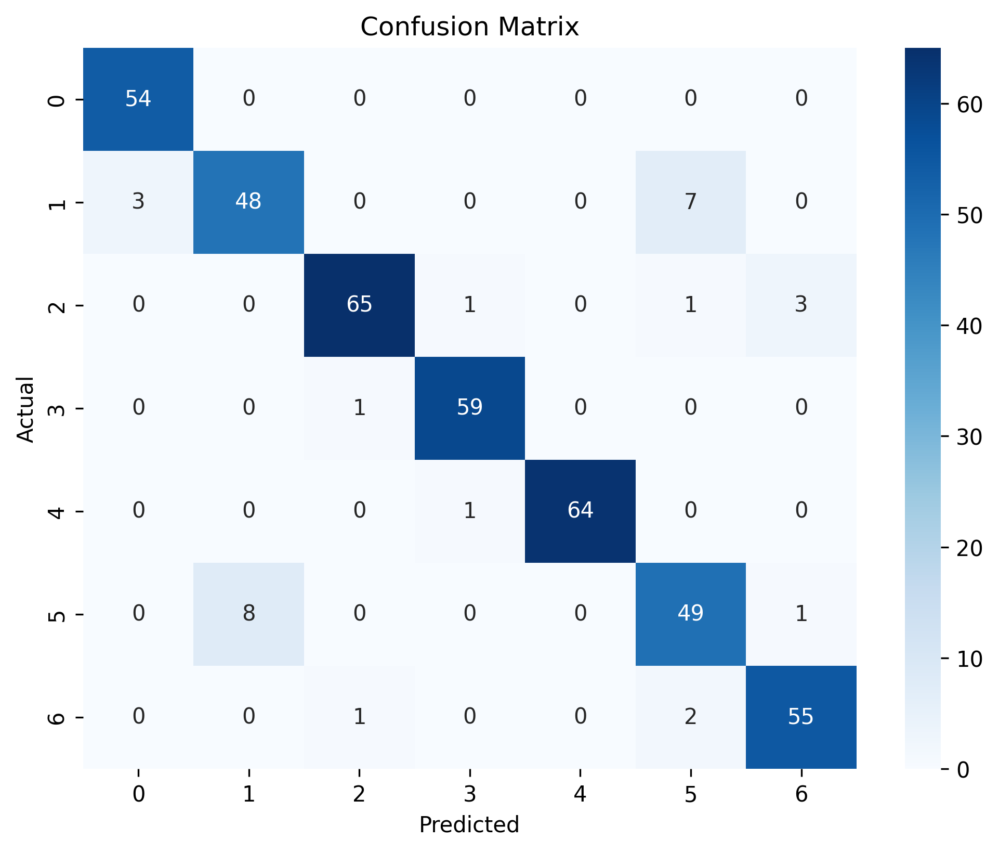

# Predicting Obesity Levels with Logistic Regression

This project develops a Logistic Regression model to predict obesity levels from clinical and lifestyle features, enabling data-driven health insights for personalized medical interventions.

## How It Works

**Dataset:** "Obesity-level-prediction-dataset.csv" (2111 entries, 17 columns) includes numerical and categorical features (e.g., BMI, physical activity) with a target of seven obesity levels (e.g., Normal Weight, Obesity Type I/II/III).

### Approach
**Exploratory Data Analysis:** Verified dataset structure (no missing values, balanced 7-class target), analyzed numerical features for outliers (boxplots) and skewness (histograms, KDE plots), explored categorical features with bar plots, and assessed feature-target correlations.

**Preprocessing:** Removed unnecessary columns, separated numerical (log-transformed with np.log1p, scaled with StandardScaler) and categorical (encoded with OneHotEncoder, handle_unknown="ignore") features, and applied ColumnTransformer and Pipeline for reproducible preprocessing.

**Model Training:** Trained a Logistic Regression model (one-vs-one strategy, max_iter=1000) with stratified train-test split to maintain class balance, saving the model with joblib.

**Tools:** Python, pandas, numpy, scikit-learn, matplotlib, seaborn, joblib.

## What I Achieved

**Results:** Achieved 93.1% accuracy, with macro and weighted F1-scores of 0.93, excelling in most classes (Obesity Type I/II/III, Normal Weight, Insufficient Weight). Minor errors occur between similar classes (e.g., Overweight I vs. II).

**Insights:** Rigorous EDA and preprocessing ensure robust predictions. Future improvements could include one-vs-rest Logistic Regression for ROC-AUC or tree-based models (Random Forest, XGBoost).

**Visualizations:**  Confusion Matrix of Model Predictions

  

## Setup

1. Clone the repo: git clone https://github.com/ZainShah740/ML-Classification-ObesityLevelPrediction-Project4.git
2. Install dependencies: pip install -r requirements.txt
3. Open obesity_prediction.ipynb in Jupyter to explore EDA, preprocessing, modeling, and evaluation.

## 🤝Connect for Collaboration
Open to discussions on ML, tech innovations, or joint projects—let’s build something impactful! 

- <a href="https://www.linkedin.com/in/zain-shah-871aa532a">
     LinkedIn
  </a>

- <a href="https://x.com/zainshah_x">
     Twitter (X)
  </a>

- <a href="mailto:btenmeten12345@gmail.com">
     Gmail
  </a>

Star if useful, and check my profile for more projects!
